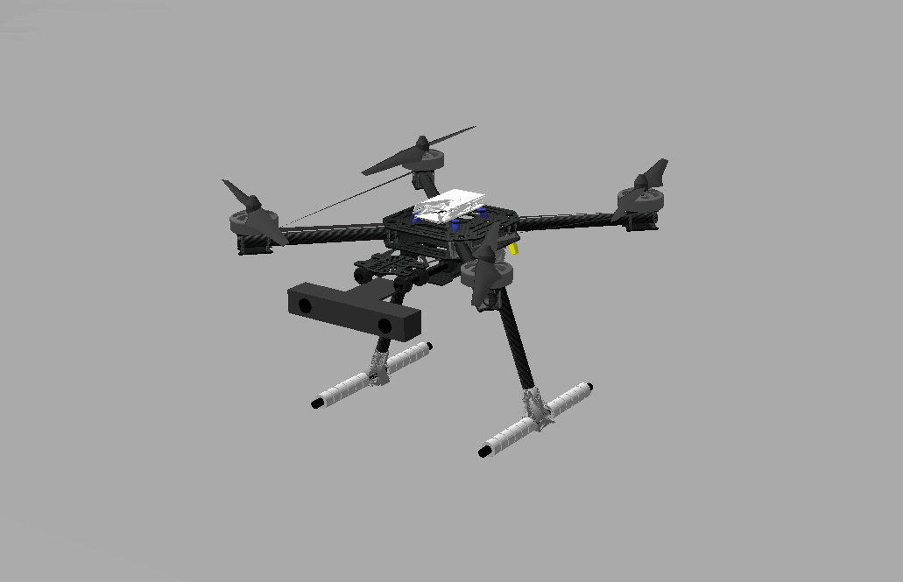

<div align="center">

# SkyInterceptor

**An autonomous drone stack for aerial filming and counter-drone interception, built from scratch on ROS 2 and simulated in Gazebo.**


</div>

<p align="center">
  <br>
  <i>Flying the drone with the keyboard in Gazebo</i>
</p>

## Overview

SkyInterceptor is a simulated drone that can switch between two missions sharing one perception → tracking → control pipeline:

| | **FOLLOW** (aerial filming) | **INTERCEPT** (counter-UAS) |
|---|---|---|
| Goal | Follow a person, bicycle or car and keep them framed | Capture an intruding small drone |
| Valid targets | `person`, `bicycle`, `car` | `uav` only; ground targets are never engaged |
| Safety rule | Never closer than `d_min` to any person or vehicle, or `d_obstacle_min` to any static obstacle | Same keep-out distances, and abort if a person, vehicle or obstacle is near the capture point |

An independent **safety filter** has the final say on every setpoint, so neither mission planner can command an unsafe motion.

## Highlights

- **Physics-based flight model.** Rotor thrust and torque (`T = k_f·ω²`), motor lag, airframe and rotor drag, wind with Gauss–Markov gusts and ground effect, all in a ROS-free C++/Eigen library that is unit-tested in a standalone 6-DOF simulation.
- **Realistic onboard controller.** Velocity PI → attitude P (SO(3)) → body-rate PI → motor mixer, wrapped as a Gazebo plugin that publishes `/odom` and TF.
- **Stereo-vision perception.** Time-synchronized stereo pair, SGBM depth, YOLOv8 detection and 3D back-projection of detections.
- **Planned estimation and guidance.** IMM-EKF tracking, a follow planner and proportional-navigation intercept guidance (see the roadmap below).
- **Engineering discipline.** Fully containerized (CUDA 11.8 + ROS 2 Humble), GTest unit tests, ament linters, and CI that builds with `-Werror`.

## Demo

Fly the drone yourself in two terminals (details in [Flying the drone](#flying-the-drone)):

```bash
make sim       # Gazebo, the park world with a walking person, and the drone
make teleop    # keyboard control: arm with t, take off with w
```

<table align="center">
  <tr>
    <td align="center"></td>
    <td align="center"></td>
  </tr>
  <tr>
    <td align="center"><i>The park world: drone, walking person, trees</i></td>
    <td align="center"><i>Drone model (Holybro X500 V2 look) with the stereo camera</i></td>
  </tr>
</table>

## Architecture

```
Perception  →  Estimation  →  Guidance  →  Control  →  Platform (Gazebo)
```

| Layer | Node | Purpose | Status |
|---|---|---|---|
| Perception | `stereo_sync_node` | Time-synchronizes the left/right camera images | ✅ Done |
| Perception | `stereo_depth_processor` | SGBM disparity → depth image | ✅ Done |
| Perception | `target_detector.py` | YOLOv8 object detection (Ultralytics) | ✅ Done |
| Perception | `target_3d_localizer` | Back-projects 2D detections to 3D positions | ✅ Done |
| Estimation | `target_tracker_node` | IMM-EKF target tracking | 🚧 Skeleton |
| Guidance | `guidance_controller_node` | Proportional navigation | 🚧 Skeleton |
| Control | `trajectory_controller_node` | Cascade PID | 🚧 Skeleton |
| Control | `hector_interface_node` | Simulator bridge | 🚧 Skeleton (being replaced) |
| Evasion | `evasion_controller_node` | Target-drone behaviour | 🚧 Skeleton |
| Platform | `quadrotor_dynamics` (Gazebo plugin) | Rotors, aerodynamics, wind, ground effect, onboard flight controller; publishes `/odom` and TF | ✅ Done |
| Platform | `drone_teleop_keyboard.py` | Keyboard teleoperation | ✅ Done |

## Roadmap

The perception layer and the flight simulation work today. Next up, in order (full details in [`IMPLEMENTATION_PLAN.md`](IMPLEMENTATION_PLAN.md)):

1. IMM-EKF tracker and a ground-truth target source
2. **FOLLOW** mode end to end (first autonomous demo)
3. **INTERCEPT** mode with proportional-navigation guidance
4. Independent safety filter, integration and docs

## Tech stack

| Area | Tools |
|---|---|
| Robotics | ROS 2 Humble, Gazebo Classic 11, TF2 |
| Languages | C++17, Python 3 |
| Libraries | Eigen, OpenCV (CUDA), Ultralytics YOLOv8 |
| Tooling | Docker, colcon, GTest, ament linters, GitHub Actions |

## Repository layout

```
SkyInterceptor/
├── Dockerfile, docker-compose.yml   # Dev container: CUDA 11.8 + ROS 2 Humble + Gazebo 11
├── docker/entrypoint.sh             # Container entrypoint (rosdep, env, welcome banner)
├── Makefile                         # All day-to-day commands (see below)
├── scripts/quick_test.sh            # Perception pipeline smoke test
├── IMPLEMENTATION_PLAN.md           # Architecture, roadmap and status
├── DOCKER.md                        # Docker details, WSL2 GPU rendering, troubleshooting
├── docs/AGENT_PROMPTS.md            # Task prompts for coding agents
├── docs/FLIGHT_DYNAMICS.md          # Flight physics, flight controller, wind, teleop
├── .github/workflows/ci.yml         # CI: static checks + build & test
└── interceptor_ws/                  # ROS 2 (colcon) workspace
    └── src/
        ├── interceptor_interfaces/  # Custom messages (msg/) and services (srv/)
        └── interceptor_drone/       # Main package
            ├── include/common/      # Shared headers: types, parameters, math utils
            ├── src/
            │   ├── common/          # Shared library (interceptor_drone_lib)
            │   ├── perception/      # stereo_sync_node, stereo_depth_processor,
            │   │                    # target_3d_localizer, target_detector.py
            │   ├── estimation/      # target_tracker_node (IMM-EKF)
            │   ├── guidance/        # guidance_controller_node (proportional navigation)
            │   ├── control/         # trajectory_controller_node, hector_interface_node
            │   ├── evasion/         # evasion_controller_node
            │   ├── flight/          # Flight dynamics library: rotors, aerodynamics,
            │   │                    # wind, flight controller (no ROS dependency)
            │   ├── simulation/      # quadrotor_dynamics Gazebo plugin
            │   └── teleop/          # drone_teleop_keyboard.py
            ├── test/                # GTest unit tests
            ├── config/              # YAML parameter files
            ├── launch/              # Launch files
            ├── urdf/, worlds/, rviz/  # Drone model, Gazebo world, RViz config
            ├── CMakeLists.txt
            └── package.xml
```

## Installation

Everything runs inside a Docker container, so the host only needs Docker.

### Prerequisites

- Linux, or Windows with WSL2
- [Docker](https://docs.docker.com/engine/install/) with the `docker-compose` command
- An NVIDIA GPU with the [NVIDIA Container Toolkit](https://docs.nvidia.com/datacenter/cloud-native/container-toolkit/latest/install-guide.html) (the compose file uses `runtime: nvidia`)
- An X server for Gazebo and RViz (WSLg on Windows)

Check that Docker can see the GPU:

```bash
docker run --rm --gpus all nvidia/cuda:11.8.0-base-ubuntu22.04 nvidia-smi
```

### Setup

```bash
git clone https://github.com/OrtizDiego/SkyInterceptor.git
cd SkyInterceptor

make build      # Build the Docker image (first time only, ~15–30 min)
make up         # Start the container in the background
make build-ws   # Build the ROS 2 workspace inside the container
```

Source code is mounted into the container, so edits on the host are visible immediately; just run `make build-ws` again. Build output lives in Docker volumes, not on the host.

For WSL2 GPU rendering and other Docker details, see [`DOCKER.md`](DOCKER.md).

## Commands

Run all `make` targets **from the host**. Everything except `make build` and `make up` needs the container to be running.

| Command | What it does |
|---|---|
| `make help` | List the available targets |
| `make build` | Build the Docker image (log written to `logs/docker-build.log`) |
| `make up` | Start the container (also allows X11 access for GUIs) |
| `make down` | Stop and remove the container |
| `make status` | Show container status |
| `make shell` | Open a bash shell inside the container |
| `make build-ws` | `colcon build` the workspace (Release, `--symlink-install`) |
| `make test` | Run the unit tests and linters (`colcon test` + `colcon test-result`) |
| `make sim` | Launch Gazebo with the drone and the scenario world |
| `make teleop` | Fly the drone with the keyboard (run it next to `make sim`) |
| `make full` | Launch the full system: simulation, perception, guidance, control and RViz |
| `make clean` | Delete `build/`, `install/` and `log/` inside the container |

### Flying the drone

```bash
make sim       # terminal 1: Gazebo, the park world with the walking person, and the drone
make teleop    # terminal 2: keyboard control
```

Press `t` to arm, then `w` to take off. The arrow keys fly forward, back, left and right, `w` / `s` climb and descend, `a` / `d` yaw, space stops and hovers, and `x` disarms. Each press changes the speed by one step, and the speed is held until you change it.

The drone flies on physics: rotor speed → thrust (T = k_f·ω²) and torques, motor lag, airframe and rotor drag, wind with gusts, and ground effect. An onboard flight controller turns the velocity commands into rotor speeds. Add wind with:

```bash
ros2 launch interceptor_drone simulation.launch.py wind_x:=4.0 wind_gust_stddev:=1.0
```

Details (equations, parameters, topics) are in [`docs/FLIGHT_DYNAMICS.md`](docs/FLIGHT_DYNAMICS.md).

### Running individual parts

Inside the container (`make shell`), source the workspace first:

```bash
source /opt/ros/humble/setup.bash && source install/setup.bash
```

Launch files:

```bash
ros2 launch interceptor_drone simulation.launch.py      # Gazebo only
ros2 launch interceptor_drone perception.launch.py      # Perception pipeline only
ros2 launch interceptor_drone guidance.launch.py        # Tracker + guidance only
ros2 launch interceptor_drone interceptor_full.launch.py
```

A single node:

```bash
ros2 run interceptor_drone stereo_sync_node
ros2 run interceptor_drone target_detector.py
```

Rebuild only one package:

```bash
colcon build --symlink-install --packages-select interceptor_drone
```

## Testing

### Unit tests and linters

```bash
make test
```

This runs:

- **GTest unit tests** in `interceptor_drone/test/` (`test_math_utils`, `test_parameters`, `test_flight_dynamics`; the latter flies the drone in a standalone 6-DOF sim)
- **ament linters**: uncrustify, cpplint, cppcheck, flake8, pep257, lint_cmake, xmllint

Inside the container you can also run the tests for a single package and see the results:

```bash
colcon test --packages-select interceptor_drone
colcon test-result --verbose
```

To auto-fix C++ formatting (from `interceptor_ws/src/interceptor_drone` inside the container):

```bash
ament_uncrustify --reformat src include test
```

### Perception smoke test

`scripts/quick_test.sh` checks that the perception pipeline starts and publishes its topics. Start the simulation with `make sim`, then in another terminal run:

```bash
make shell
bash scripts/quick_test.sh
```

### Continuous integration

[`.github/workflows/ci.yml`](.github/workflows/ci.yml) runs on every pull request and every push to `main`:

1. **Static checks**: yamllint, shellcheck and Python syntax.
2. **Build & test**: `colcon build` with `-Werror`, then `colcon test` in the `ros:humble-perception` container.

The CI container has no CUDA, so the code must also build without a GPU.

You can run the static checks locally without ROS:

```bash
pip install yamllint shellcheck-py
yamllint --strict .
git ls-files '*.sh' | xargs shellcheck --severity=warning
git ls-files '*.py' | xargs python3 -m py_compile
```

## Configuration

Parameters are in `interceptor_ws/src/interceptor_drone/config/`:

| File | Contents |
|---|---|
| `perception_params.yaml` | Stereo camera (baseline, intrinsics) and detector settings |
| `stereo_sync_params.yaml` | Stereo synchronization tolerance |
| `ekf_params.yaml` | Tracker process and measurement noise |
| `guidance_params.yaml` | Navigation constants and acceleration limits |
| `controller_params.yaml` | PID gains and limits |

Custom messages are defined in `interceptor_ws/src/interceptor_interfaces/`: `TargetDetection`, `TargetState`, `GuidanceCommand`, `TargetTrajectory`, `StereoImagePair` and the `SetInterceptMode` service.
